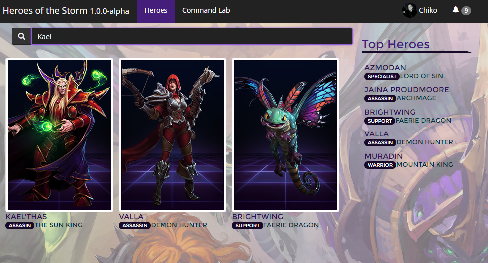

# ng2-heroes
Angular 2 heroes sample project with a mini application of [Hereos of the Storm](http://us.battle.net/heroes/en/) heroes.

## What does it have?
 - gulp
 - sass
 - systemjs
 - angular2
 - routing
 - [redux](http://redux.js.org/) using [@ngrx](https://github.com/ngrx/store)
 - structure
   - sass theming
   - per feature structure
 - sexy styling ;)



## What it doesn't have?
Structure is not entirely polished for production e.g. no bundling

# Getting started


## Install

```
npm install

// create symbolic link in `wwwroot` to point to `node_modules`
```

## Build

```
gulp build
```

## Run/watch

```
gulp watch
```
